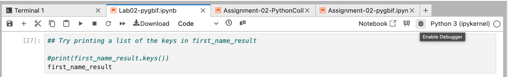
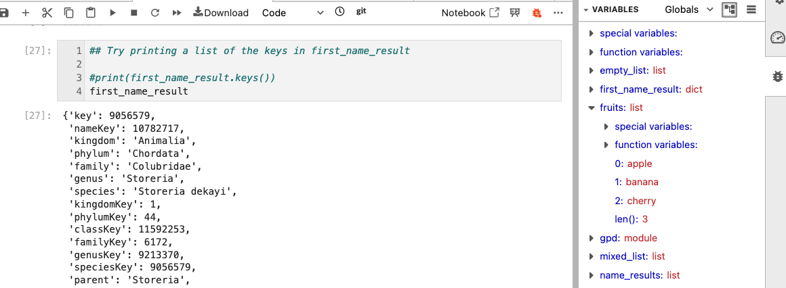
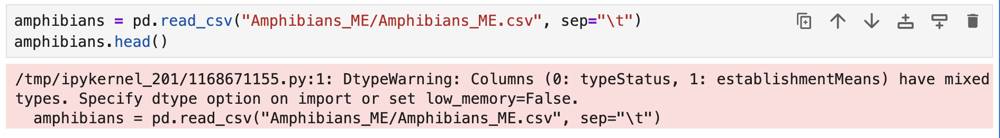

# Frequenty Asked Questions

### I am stuck inside something weird on the command line!

If you ever get 'stuck' inside a command line session and you want to
get unstuck the most reliable trick is to type Ctrl+c (hold the control
key and push 'c'). This is like an instant quit command for 99% of 
command line tools.

### What do I do when I get stuck in this window and why did it happen?

{ width="400" }

This is the `nano` command-line text editor. On the first day we set `nano`
as the default editor for `git`. You will see this in your terminal if you
forget to add the `-m` argument when you commit files
(e.g. `git commit` vs `git commit -m "my commit message"`). All commits
**require** a commit message, so if you leave off the `-m` then it drops
you into the default editor so you can type in the commit message manually
(which is also totally fine).

**How do I get out of this?:** `nano` accepts keyboard shortcut commands,
most of which it shows at the bottom of the screen. The '^' symbol means
'Ctrl', so `^X` hold the Ctrl key and push "X", which will exit the program.

### How do I properly reference files inside my class github repository?

The **absolute** path to your class github repository is: `/home/jovyan/BIO597-SpatialBiodiversity`.

!!! info

    'jovyan' is the default username inside jupyter so this will be the same for everyone. 

If you are working on an assignment, the **relative** path to the `EasternSnakes`
directory is: `../labs/EasternSnakes`.

File paths are always tricky because they rely on having a 'sense' of where you 
are in the filesystem and how to navigate around it. **Absolute** paths fully 
specify the location of a file from the 'root' of the filesystem (which is 
indicated by the first "/"). **Relative** paths will usually start with a '.'
(meaning "this directory") or a '..' (meaning one directory up).

### How do I see information about all the variables that are active in a jupyter notebook?

There are two ways to do this. The first way is to use the `%whos` magic command.
Inside a new cell you can type `%whos` and it will give information about all the
variables you have created.

{ width="400" }

This is *fine* but you can't browse it like the variables pane in RStudio. To get
a more interactive view of the variables you can enable the **debugger** by clicking
the little bug shaped button (it might be hidden inside a 'three-dots' menu on the
right side of the command bar).
{ width="400" }

After you do this (it might open immediately) you will see the 'bug' menu on the
right side and if you open this you will see a 'variables' panel much like in
RStudio, where you can click on variable names to see their current contents.

{ width="400" }

### Why am I getting an error when loading a csv file (e.g. `DTypeWarning`)?

For the Maine Amphibian data for Assignment 3, when you load this data
you get a warning message:

{ width="400" }

First, this is a **warning** only, which means it still worked but it wants
you to be aware of something. In this case there are two columns in the input
csv (`typeStatus` and `establishmentMeans`) which have "mixed" types. You can 
see what this means if you query one of these columns and use the `set()` 
function to retain only unique elements:

```python
set(amphibians["establishmentMeans"])
```
```
{nan, 'native', 'uncertain'}
```
Here you can see there are two *string* type elements ('native' and 'uncertain')
and there is `nan` which stands for "Not a Number" and which is often used
as a default value for non-existent records. `nan` is also treated internally
as a `float`, so this column has both `string` and `float` values (which
is what the warning is about.

Buried in this warning you can see that it is trying to be helpful in
suggesting to use `low_memory=False`, and indeed this will get rid of the
error. You can also **safely ignore this** for this exercise because
we aren't using the values from either of these columns anyway.
