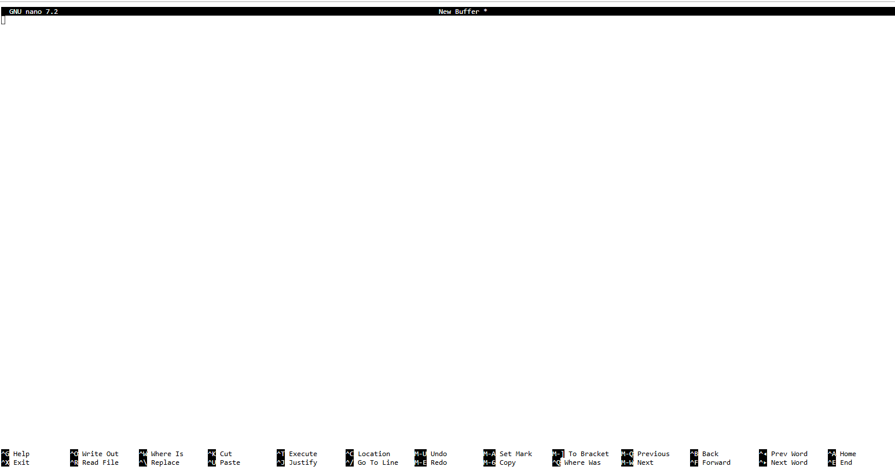

# Frequenty Asked Questions

### I am stuck inside something weird on the command line!

If you ever get 'stuck' inside a command line session and you want to
get unstuck the most reliable trick is to type Ctrl+c (hold the control
key and push 'c'). This is like an instant quit command for 99% of 
command line tools.

### What do I do when I get stuck in this window and why did it happen?

{ width="400" }

This is the `nano` command-line text editor. On the first day we set `nano`
as the default editor for `git`. You will see this in your terminal if you
forget to add the `-m` argument when you commit files
(e.g. `git commit` vs `git commit -m "my commit message"`). All commits
**require** a commit message, so if you leave off the `-m` then it drops
you into the default editor so you can type in the commit message manually
(which is also totally fine).

**How do I get out of this?:** `nano` accepts keyboard shortcut commands,
most of which it shows at the bottom of the screen. The '^' symbol means
'Ctrl', so `^X` hold the Ctrl key and push "X", which will exit the program.

### How do I properly reference files inside my class github repository?

The **absolute** path to your class github repository is: `/home/jovyan/BIO597-SpatialBiodiversity`.

!!! info

    'jovyan' is the default username inside jupyter so this will be the same for everyone. 

If you are working on an assignment, the **relative** path to the `EasternSnakes`
directory is: `../labs/EasternSnakes`.

File paths are always tricky because they rely on having a 'sense' of where you 
are in the filesystem and how to navigate around it. **Absolute** paths fully 
specify the location of a file from the 'root' of the filesystem (which is 
indicated by the first "/"). **Relative** paths will usually start with a '.'
(meaning "this directory") or a '..' (meaning one directory up).

